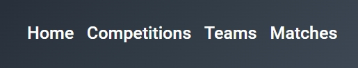

# Приложение SoccerStat
## Запуск
Загрузите проект. После запустите его с помощью команды __npm start__

## Что включает в себя приложение SoccerStat?
Данное приложение состоит из четырех страниц: Home, Competitions, Teams, Matches.

1. На странице Competitions находится Список лиг/соревнований.
2. На странице Teams находится Список команд.
3. На странице Matches находится список матчей лиги/соревнования.
4. На главной странице указан текущий токен и моя контактная информация.
5. На странице Teams можно кликнуть на любую команду, после чего откроется список матчей данной команды.
6. На странице Competitions и Teams присутствует поиск по названию лиги и назвнию команды.
6. На странице Matches присутствует поиск матчей по датам.
